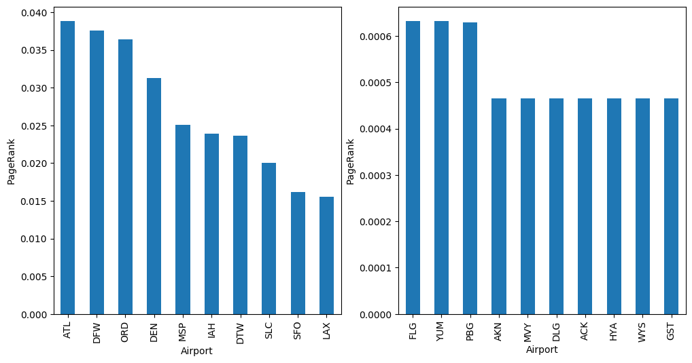

# PageRank Algorithm on Flights Dataset

- author: Kaixin Wang
- UCLA Statistics 202C Final Project
- Spring 2021

In this notebook, we will analyze the Flights dataset using the PageRank algorithm. Flights dataset consists of three data files, `flights.csv`, `airports.csv` and `airlines.csv`, which are collected by the Bureau of Transportation Statistics and are available online at https://www.kaggle.com/usdot/flight-delays.

The `flights.csv` dataset contains the information around 1 million delayed flights in 2015. The `airports.csv` dataset contains the information of 322 airports in the United States. The goal is to analyze which airports are the center for flight delays by calculating the PageRank of each airport.

Recall that the PageRank is a measure of how important a node is inside a graph (or network) described as a probability. The general formula for computing the PageRank is as follows:


$$`PR(i) = \frac{1-d}{N} + d \sum_{j \in M(i)} \frac{PR(j)}{L(j)}, i = 1, ..., N`$$

where $`PR(i)`$ represents the PageRank of node $`i`$, $`d`$ is the damping factor (typically has the value of 0.85), $`N`$ is the total number of nodes, $`M(i)`$ is the set of nodes that have outbound links to node $`i`$, and $`L(j)`$ is the number of outbound links that node $`j`$ has. 

## Preparation

### Library Import


```python
import numpy as np
import pandas as pd
import seaborn as sns
import matplotlib.pyplot as plt
```

### Data Import


```python
flights = pd.read_csv("flights.csv")
airports = pd.read_csv("airports.csv", index_col = 0)
airlines = pd.read_csv("airlines.csv", index_col = 0)
```


```python
flights.head()
```


<div>
<table border="1" class="dataframe">
  <thead>
    <tr style="text-align: right;">
      <th></th>
      <th>YEAR</th>
      <th>MONTH</th>
      <th>DAY</th>
      <th>DAY_OF_WEEK</th>
      <th>AIRLINE</th>
      <th>FLIGHT_NUMBER</th>
      <th>TAIL_NUMBER</th>
      <th>ORIGIN_AIRPORT</th>
      <th>DESTINATION_AIRPORT</th>
      <th>SCHEDULED_DEPARTURE</th>
      <th>...</th>
      <th>ARRIVAL_TIME</th>
      <th>ARRIVAL_DELAY</th>
      <th>DIVERTED</th>
      <th>CANCELLED</th>
      <th>CANCELLATION_REASON</th>
      <th>AIR_SYSTEM_DELAY</th>
      <th>SECURITY_DELAY</th>
      <th>AIRLINE_DELAY</th>
      <th>LATE_AIRCRAFT_DELAY</th>
      <th>WEATHER_DELAY</th>
    </tr>
  </thead>
  <tbody>
    <tr>
      <th>0</th>
      <td>2015</td>
      <td>1</td>
      <td>1</td>
      <td>4</td>
      <td>AS</td>
      <td>98</td>
      <td>N407AS</td>
      <td>ANC</td>
      <td>SEA</td>
      <td>5</td>
      <td>...</td>
      <td>408.0</td>
      <td>-22.0</td>
      <td>0</td>
      <td>0</td>
      <td>NaN</td>
      <td>NaN</td>
      <td>NaN</td>
      <td>NaN</td>
      <td>NaN</td>
      <td>NaN</td>
    </tr>
    <tr>
      <th>1</th>
      <td>2015</td>
      <td>1</td>
      <td>1</td>
      <td>4</td>
      <td>AA</td>
      <td>2336</td>
      <td>N3KUAA</td>
      <td>LAX</td>
      <td>PBI</td>
      <td>10</td>
      <td>...</td>
      <td>741.0</td>
      <td>-9.0</td>
      <td>0</td>
      <td>0</td>
      <td>NaN</td>
      <td>NaN</td>
      <td>NaN</td>
      <td>NaN</td>
      <td>NaN</td>
      <td>NaN</td>
    </tr>
    <tr>
      <th>2</th>
      <td>2015</td>
      <td>1</td>
      <td>1</td>
      <td>4</td>
      <td>US</td>
      <td>840</td>
      <td>N171US</td>
      <td>SFO</td>
      <td>CLT</td>
      <td>20</td>
      <td>...</td>
      <td>811.0</td>
      <td>5.0</td>
      <td>0</td>
      <td>0</td>
      <td>NaN</td>
      <td>NaN</td>
      <td>NaN</td>
      <td>NaN</td>
      <td>NaN</td>
      <td>NaN</td>
    </tr>
    <tr>
      <th>3</th>
      <td>2015</td>
      <td>1</td>
      <td>1</td>
      <td>4</td>
      <td>AA</td>
      <td>258</td>
      <td>N3HYAA</td>
      <td>LAX</td>
      <td>MIA</td>
      <td>20</td>
      <td>...</td>
      <td>756.0</td>
      <td>-9.0</td>
      <td>0</td>
      <td>0</td>
      <td>NaN</td>
      <td>NaN</td>
      <td>NaN</td>
      <td>NaN</td>
      <td>NaN</td>
      <td>NaN</td>
    </tr>
    <tr>
      <th>4</th>
      <td>2015</td>
      <td>1</td>
      <td>1</td>
      <td>4</td>
      <td>AS</td>
      <td>135</td>
      <td>N527AS</td>
      <td>SEA</td>
      <td>ANC</td>
      <td>25</td>
      <td>...</td>
      <td>259.0</td>
      <td>-21.0</td>
      <td>0</td>
      <td>0</td>
      <td>NaN</td>
      <td>NaN</td>
      <td>NaN</td>
      <td>NaN</td>
      <td>NaN</td>
      <td>NaN</td>
    </tr>
  </tbody>
</table>
<p>5 rows × 31 columns</p>
</div>


```python
airports.head()
```


<div>
<table border="1" class="dataframe">
  <thead>
    <tr style="text-align: right;">
      <th></th>
      <th>AIRPORT</th>
      <th>CITY</th>
      <th>STATE</th>
      <th>COUNTRY</th>
      <th>LATITUDE</th>
      <th>LONGITUDE</th>
    </tr>
    <tr>
      <th>IATA_CODE</th>
      <th></th>
      <th></th>
      <th></th>
      <th></th>
      <th></th>
      <th></th>
    </tr>
  </thead>
  <tbody>
    <tr>
      <th>ABE</th>
      <td>Lehigh Valley International Airport</td>
      <td>Allentown</td>
      <td>PA</td>
      <td>USA</td>
      <td>40.65236</td>
      <td>-75.44040</td>
    </tr>
    <tr>
      <th>ABI</th>
      <td>Abilene Regional Airport</td>
      <td>Abilene</td>
      <td>TX</td>
      <td>USA</td>
      <td>32.41132</td>
      <td>-99.68190</td>
    </tr>
    <tr>
      <th>ABQ</th>
      <td>Albuquerque International Sunport</td>
      <td>Albuquerque</td>
      <td>NM</td>
      <td>USA</td>
      <td>35.04022</td>
      <td>-106.60919</td>
    </tr>
    <tr>
      <th>ABR</th>
      <td>Aberdeen Regional Airport</td>
      <td>Aberdeen</td>
      <td>SD</td>
      <td>USA</td>
      <td>45.44906</td>
      <td>-98.42183</td>
    </tr>
    <tr>
      <th>ABY</th>
      <td>Southwest Georgia Regional Airport</td>
      <td>Albany</td>
      <td>GA</td>
      <td>USA</td>
      <td>31.53552</td>
      <td>-84.19447</td>
    </tr>
  </tbody>
</table>
</div>


```python
airlines.head()
```


<div>
<table border="1" class="dataframe">
  <thead>
    <tr style="text-align: right;">
      <th></th>
      <th>AIRLINE</th>
    </tr>
    <tr>
      <th>IATA_CODE</th>
      <th></th>
    </tr>
  </thead>
  <tbody>
    <tr>
      <th>UA</th>
      <td>United Air Lines Inc.</td>
    </tr>
    <tr>
      <th>AA</th>
      <td>American Airlines Inc.</td>
    </tr>
    <tr>
      <th>US</th>
      <td>US Airways Inc.</td>
    </tr>
    <tr>
      <th>F9</th>
      <td>Frontier Airlines Inc.</td>
    </tr>
    <tr>
      <th>B6</th>
      <td>JetBlue Airways</td>
    </tr>
  </tbody>
</table>
</div>


### Preliminary Analysis

Using the Python package `networkkx`, we can visualize the flights network. For example, the figure below shows all airports that have flights going to LAX (left) and JFK (right):


```python
import networkx as nx
LAX = nx.from_pandas_edgelist(flights.loc[flights["DESTINATION_AIRPORT"] == "LAX", :], 
                             source='ORIGIN_AIRPORT', target='DESTINATION_AIRPORT', 
                             edge_attr=True)
SFO = nx.from_pandas_edgelist(flights.loc[flights["DESTINATION_AIRPORT"] == "JFK", :], 
                             source='ORIGIN_AIRPORT', target='DESTINATION_AIRPORT', 
                             edge_attr=True)
```


```python
plt.figure(figsize=(12,6), dpi=100)
plt.subplot(1,2,1)
nx.draw(LAX, with_labels = True, node_size=500, alpha=0.8)
plt.subplot(1,2,2)
nx.draw(SFO, with_labels = True, node_size=500, node_color="orange", alpha=0.8)
```


## PageRank Algorithm

### Build the Directed Graph of Airports


```python
# get the airport code from airports dataset
code = airports.index
n = code.shape[0]
n
```


    322


```python
# create an empty data frame to store the directed graph
graph = np.zeros([n, n])
graph = pd.DataFrame(graph)
graph.columns = code
graph.index = code
graph.head()
```


<div>
<table border="1" class="dataframe">
  <thead>
    <tr style="text-align: right;">
      <th>IATA_CODE</th>
      <th>ABE</th>
      <th>ABI</th>
      <th>ABQ</th>
      <th>ABR</th>
      <th>ABY</th>
      <th>ACK</th>
      <th>ACT</th>
      <th>ACV</th>
      <th>ACY</th>
      <th>ADK</th>
      <th>...</th>
      <th>TYS</th>
      <th>UST</th>
      <th>VEL</th>
      <th>VLD</th>
      <th>VPS</th>
      <th>WRG</th>
      <th>WYS</th>
      <th>XNA</th>
      <th>YAK</th>
      <th>YUM</th>
    </tr>
    <tr>
      <th>IATA_CODE</th>
      <th></th>
      <th></th>
      <th></th>
      <th></th>
      <th></th>
      <th></th>
      <th></th>
      <th></th>
      <th></th>
      <th></th>
      <th></th>
      <th></th>
      <th></th>
      <th></th>
      <th></th>
      <th></th>
      <th></th>
      <th></th>
      <th></th>
      <th></th>
      <th></th>
    </tr>
  </thead>
  <tbody>
    <tr>
      <th>ABE</th>
      <td>0.0</td>
      <td>0.0</td>
      <td>0.0</td>
      <td>0.0</td>
      <td>0.0</td>
      <td>0.0</td>
      <td>0.0</td>
      <td>0.0</td>
      <td>0.0</td>
      <td>0.0</td>
      <td>...</td>
      <td>0.0</td>
      <td>0.0</td>
      <td>0.0</td>
      <td>0.0</td>
      <td>0.0</td>
      <td>0.0</td>
      <td>0.0</td>
      <td>0.0</td>
      <td>0.0</td>
      <td>0.0</td>
    </tr>
    <tr>
      <th>ABI</th>
      <td>0.0</td>
      <td>0.0</td>
      <td>0.0</td>
      <td>0.0</td>
      <td>0.0</td>
      <td>0.0</td>
      <td>0.0</td>
      <td>0.0</td>
      <td>0.0</td>
      <td>0.0</td>
      <td>...</td>
      <td>0.0</td>
      <td>0.0</td>
      <td>0.0</td>
      <td>0.0</td>
      <td>0.0</td>
      <td>0.0</td>
      <td>0.0</td>
      <td>0.0</td>
      <td>0.0</td>
      <td>0.0</td>
    </tr>
    <tr>
      <th>ABQ</th>
      <td>0.0</td>
      <td>0.0</td>
      <td>0.0</td>
      <td>0.0</td>
      <td>0.0</td>
      <td>0.0</td>
      <td>0.0</td>
      <td>0.0</td>
      <td>0.0</td>
      <td>0.0</td>
      <td>...</td>
      <td>0.0</td>
      <td>0.0</td>
      <td>0.0</td>
      <td>0.0</td>
      <td>0.0</td>
      <td>0.0</td>
      <td>0.0</td>
      <td>0.0</td>
      <td>0.0</td>
      <td>0.0</td>
    </tr>
    <tr>
      <th>ABR</th>
      <td>0.0</td>
      <td>0.0</td>
      <td>0.0</td>
      <td>0.0</td>
      <td>0.0</td>
      <td>0.0</td>
      <td>0.0</td>
      <td>0.0</td>
      <td>0.0</td>
      <td>0.0</td>
      <td>...</td>
      <td>0.0</td>
      <td>0.0</td>
      <td>0.0</td>
      <td>0.0</td>
      <td>0.0</td>
      <td>0.0</td>
      <td>0.0</td>
      <td>0.0</td>
      <td>0.0</td>
      <td>0.0</td>
    </tr>
    <tr>
      <th>ABY</th>
      <td>0.0</td>
      <td>0.0</td>
      <td>0.0</td>
      <td>0.0</td>
      <td>0.0</td>
      <td>0.0</td>
      <td>0.0</td>
      <td>0.0</td>
      <td>0.0</td>
      <td>0.0</td>
      <td>...</td>
      <td>0.0</td>
      <td>0.0</td>
      <td>0.0</td>
      <td>0.0</td>
      <td>0.0</td>
      <td>0.0</td>
      <td>0.0</td>
      <td>0.0</td>
      <td>0.0</td>
      <td>0.0</td>
    </tr>
  </tbody>
</table>
<p>5 rows × 322 columns</p>
</div>


```python
# loop through all flights and record the adjacency relations
# for i in range(flights.shape[0]):
#     flight = flights.iloc[[i], :]
#     departure = flight["ORIGIN_AIRPORT"].values[0]
#     arrival = flight["DESTINATION_AIRPORT"].values[0]
#     if departure in graph.columns and arrival in graph.columns:
#         if graph.loc[departure, arrival] == 0:
#             graph.loc[departure, arrival] = 1
```


```python
# save the graph to a csv file to re-use next time
# graph.to_csv("Graph_flights.csv", index=True)
graph = pd.read_csv("Graph_flights.csv", index_col=0)
```

### PageRank Implementations

#### Initializations


```python
N = graph.shape[0]
# initial PageRank vector
p = np.tile(1/N, N)
p = p.reshape(N, 1)
# count vector
c = np.sum(graph, axis=0)
# C^{-1}
C_inv = np.diag(1/c)
# damping factor
d = 0.85
```

#### Implementation


```python
# n: number of iterations
n = 50
# array to store the PageRank values in each iteration
pageranks = np.zeros([N, n])
pageranks[:, [0]] = p
# main algorithm
for i in range(1, n):
    p = pageranks[:, [i-1]]
    result = C_inv @ p
    result[np.isinf(result)] = 0
    result = d * graph.values.T @ result
    pageranks[:, [i]] = (1-d) / N + result
```

#### Convergence of PageRank


```python
# convert to a data frame
pageranks = pd.DataFrame(pageranks)
pageranks.index = graph.index
```


```python
plt.figure(figsize=(12,6), dpi=100)
plt.subplot(1,2,1)
# top 10 airports
pageranks.iloc[:, -1].sort_values(ascending=False).head(10).plot(kind="bar")
plt.ylabel("PageRank")
plt.xlabel("Airport")
plt.subplot(1,2,2)
# bottom 10 airports
pageranks.iloc[:, -1].sort_values(ascending=False).tail(10).plot(kind="bar")
plt.ylabel("PageRank")
plt.xlabel("Airport")
plt.show()
```





```python
# convergence of top 10 airports
plt.figure(figsize=(6,6), dpi=100)
top = pageranks.iloc[:, -1].sort_values(ascending=False).head(10)
for i in range(top.shape[0]):
    plt.plot(pageranks.loc[top.index[i], :], label=top.index[i])
plt.xlabel("iteration")
plt.ylabel("PageRank")
plt.legend(frameon=False, ncol=2)
plt.show()
```


## Results and Analysis

### Import `geopandas` and dependencies


```python
# need to download geopandas and its dependencies before use
# import descartes
# import shapely
# import fiona
# import rtree
# import pyproj
import geopandas as gpd
from shapely.geometry import Point, Polygon
```

### Create a `geopandas` data frame


```python
# create the geometry points
geometry = [Point(xy) for xy in zip(airports["LONGITUDE"], airports["LATITUDE"])]
# define the CRS code
crs = {"init":"epsg:4326"}
# create the geodataframe
geo_df = gpd.GeoDataFrame(pageranks.iloc[:, [-1]], crs = crs, geometry = geometry)
geo_df.columns = ["PageRank", "geometry"]
```

### Read in the states map in the U.S.


```python
states = gpd.read_file('usa-states-census-2014.shp')
type(states)
```


    geopandas.geodataframe.GeoDataFrame


### Plot the U.S. states map


```python
# store the converged PageRank vector
pagerank = pageranks.iloc[:, [-1]]
pagerank.columns = ["PageRank"]
```


```python
fig, ax = plt.subplots(figsize=(10, 6), dpi=120)
# plot the states map
states.plot(cmap='Pastel2', ax=ax)
# add the scatters for each airport
geo_df.plot(ax=ax, markersize=geo_df["PageRank"] * 4000)
# add text to the top 12 airports
top = pagerank.sort_values("PageRank", ascending=False).head(12)
for i in range(top.shape[0]):
    ax.text(airports.loc[list(top.index), :]["LONGITUDE"].values[i] - 1, 
            airports.loc[list(top.index), :]["LATITUDE"].values[i] + 0.6, list(top.index)[i])
ax.set_xlim([-130, -60])
ax.set_ylim([23, 50])
ax.set_xlabel("Longitude")
ax.set_ylabel("Latitude")
plt.show()
```


```python
departure = flights["ORIGIN_AIRPORT"].value_counts().loc[top.index]
arrival = flights["DESTINATION_AIRPORT"].value_counts().loc[top.index]
# pd.DataFrame([origin, departure]).T.to_csv("Count_flights.csv", index=True)
plt.figure(figsize=(11.5,5), dpi=100)
plt.subplot(1,2,1)
departure.plot(kind="bar")
plt.xlabel("Airport"); plt.ylabel("Number of Departures")
plt.subplot(1,2,2)
arrival.plot(kind="bar")
plt.xlabel("Airport"); plt.ylabel("Number of Arrivals")
plt.show()
```


# References

1. Song, S., and Alabi, D. (2013), “PageRank on flights dataset,” MangoDB Blog. https://www.mongodb.com/blog/post/pagerank-on-flights-dataset.
2. Department of Transportation (2015), "2015 Flight Delays and Cancellations," Kaggle. https://www.kaggle.com/usdot/flight-delays.
3. Stewart, R. (2018), "GeoPandas 101: Plot any data with a latitude and longitude on a map," Towards Data Science. https://towardsdatascience.com/geopandas-101-plot-any-data-with-a-latitude-and-longitude-on-a-map-98e01944b972.
4. Jcutrer (2020), "GeoPandas Tutorial: How to plot US Maps in Python," Jcutrer. https://jcutrer.com/python/learn-geopandas-plotting-usmaps. 
5. Sheikh, S. (2019), "The Graph Theory — An Introduction In Python," Medium. https://medium.com/apprentice-journal/the-graph-theory-an-introduction-in-python-5906d5be0e4b

